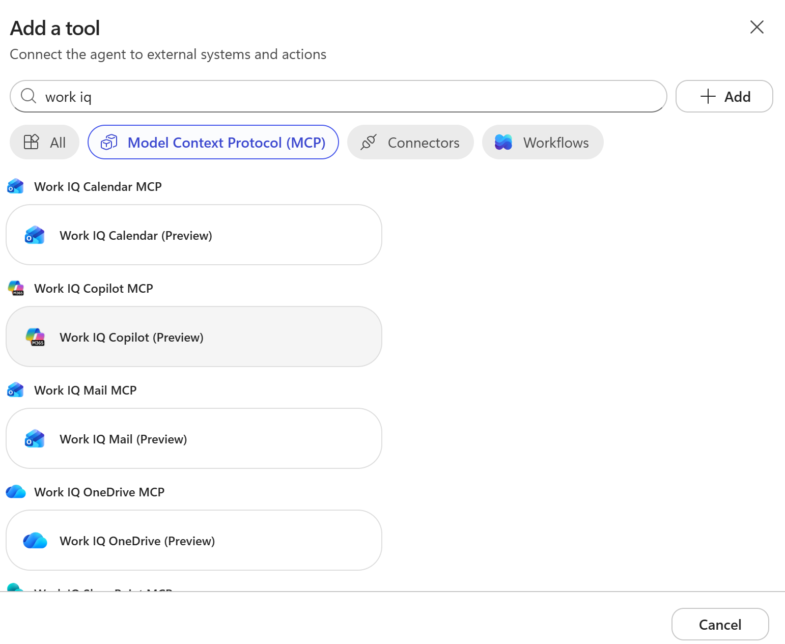
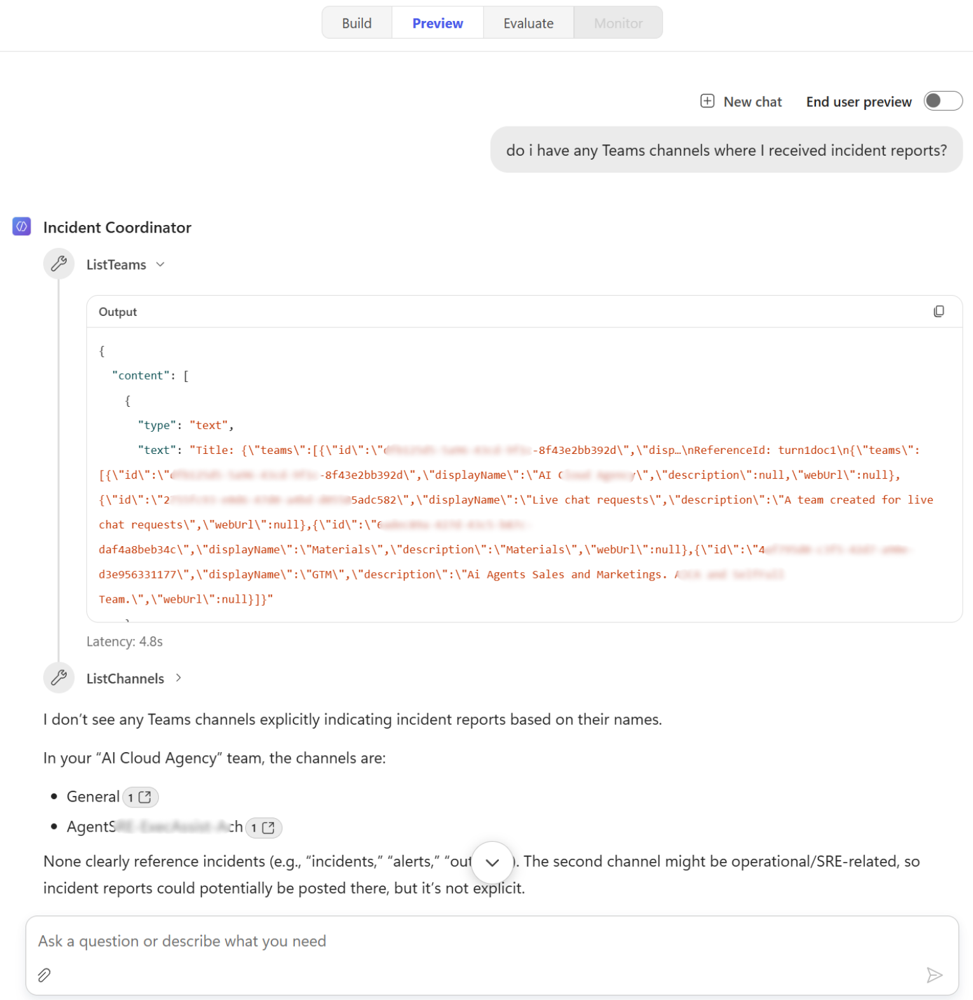
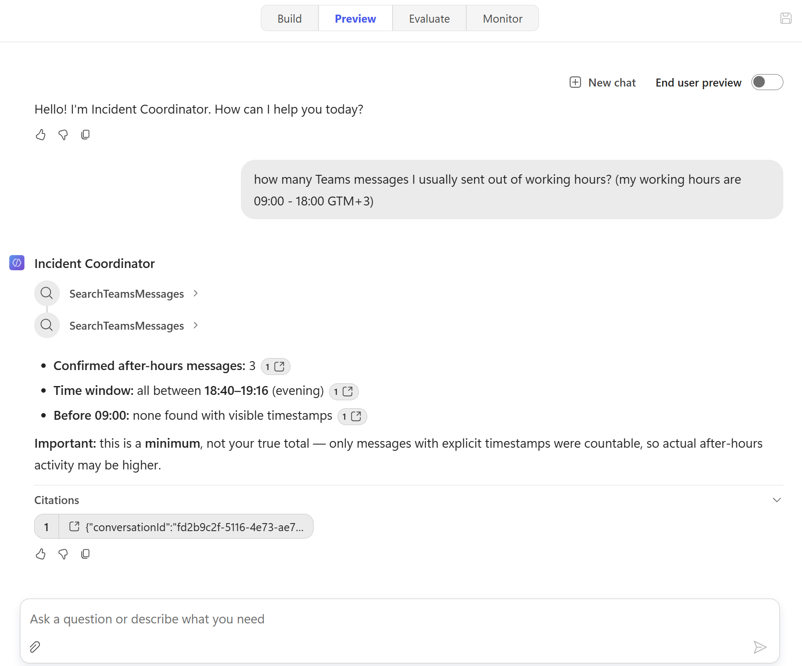

# Lab 1 — Build the Incident Coordinator in Copilot Studio

## Part 2 — Work IQ parallel track (15 min)

> **This part splits into two tracks. Check which one applies to you.**

---

### Track A — Work IQ track (requires Microsoft 365 Copilot licence)

#### Step 2A-1 — Add the Work IQ Teams MCP server

1. Go back to **Build** tab.
2. Click plus icon next to **Tools**.
3. Search and select **Work IQ Copilot (Preview)**.


4. A connection prompt may appear asking you to sign in to authorise access. Click **Connect** and complete the authentication if prompted. Once connection has been created, click **Add**.
5. The Work IQ Copilot now appears in your agent's tool list.
6. You also can add **Work IQ Teams (Preview)**.

#### Step 2A-2 — Update the agent instructions to use org context

1. Update the agent's instructions. At the very top of the instructions, before the first line, add:

   ```
   Before classifying any incident, search Work IQ Files for any prior incidents, system outages, or maintenance records involving the same system, service, or team mentioned in the report. If you find relevant history, reference it in your assessment and note it in the Management summary.
   ```

2. Click **Save**.

#### Step 2A-3 — Test with an org-contextual incident

1. Open the **Preview** page.
2. Click **New chat**.
3. Submit this incident:
   
   ```
   Do i have any Teams channels where I received incident reports?
   ```

4. Observe: does the agent use Work IQ to check for Teams channels? Does the response mention historical context?

> Expected answer involve Work IQ tool.


5. You can also ask question about you out of working hours activities:
   ```
   How many Teams messages I usually sent out of working hours? (my working hours are 09:00 - 18:00 GTM+3)
   ```

6. Observe the answer you receives. Sample of answer:


> **What you're learning:** Work IQ grounds the agent in live organisational signals — real emails, real files, real meeting notes from your Microsoft 365 tenant. Compare this with the playbook-only grounding in the standard track. For the Contoso scenario, this matters when prior incident history should influence severity scoring.

---

### Track B — Standard track (no M365 Copilot licence required)

#### Step 2B-1 — Test incidents 6–10

1. In the **Test** panel, submit several of incidents (you can find them in the [evaluation-set-10](./assets/evaluation-set-10.jsonl) file).
2. For each response, check:
   - Is the structured format consistent across all incidents?
   - Does the risk score seem calibrated (Critical incidents score 8–10, Low incidents score 1–3)?
   - Does the management summary avoid jargon?

3. Try editing the instructions to force more consistent JSON-like output. On the **Build** page edit the Instructions by adding this line at the end:

   ```
   Always use the exact field labels as specified. Never abbreviate field names or skip fields.
   ```

4. Click **Save**, then click **New chat** on the **Preview** page and re-test one incident.

---

### Whole group debrief (3 minutes)

> The trainer will ask both tracks to share:  
> **Work IQ track:** What did org context add? Was it relevant? Could it change the severity decision?  
> **Standard track:** How far could you get with prompt engineering alone? Where did it still vary?

