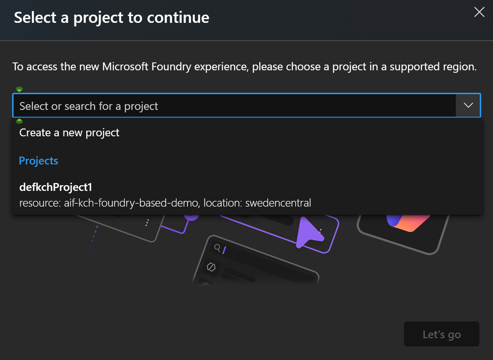
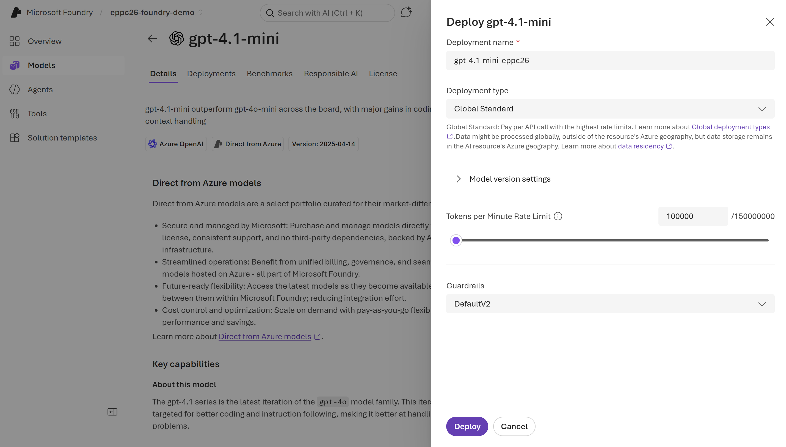

# Lab 2 — Build the Intelligence Layer in Microsoft Foundry

## Part 1 — Create your Foundry project and deploy the model (10 min)

### Step 1 — Open the Foundry portal and enable New Foundry

1. Open your browser (Chrome or Edge).
2. Navigate to **https://ai.azure.com**
3. Sign in with the Microsoft account linked to your Azure subscription.
4. You land on the Foundry home page. Look at the **top navigation bar** — find the toggle labelled **"New Foundry"** (it may appear as a banner or a toggle near the top-right of the screen).
5. In the drop-down list select existing project. If you don't have a project yet - go to the Step 2 and create a new project.
6. Make sure the **New Foundry toggle is ON** (blue/enabled). If it is off, click it to enable it.

   > **Why this matters:** The New Foundry experience is where Workflows, Foundry IQ, and the Control Plane live. The classic view does not have these features. Everything in this lab requires New Foundry to be on.

---

### Step 2 — Create a new Foundry project

1. On the **Select a project to continue** pop-up window, click on drop-down list and hit **Create a new project**.



2. The project creation form opens. Fill in the fields:

   **Project name:**
   ```
   eppc26-foundry-demo
   ```
   > You can choose your own name

   **Subscription:** Select your Azure subscription from the dropdown.

   **Resource group:** Either select an existing resource group or click
   **Create new** and type:
   ```
   rg-eppc26-foundry-demo
   ```

   **Region:** Select **Sweden Central**.

   

   > If Sweden Central is not available in your subscription, use **East US 2** as the fallback. Do NOT use Italy North or Brazil South — File Search and some agent features are unavailable there.
   > Check tools support by regions [here](https://learn.microsoft.com/en-us/azure/foundry/agents/concepts/tool-best-practice#tool-support-by-region-and-model).

   Leave all other fields at their defaults.

3. Click **Create**.

   > Provisioning takes 60–120 seconds. The new Foundry UI creates exactly two resources in your resource group:
   > - A Foundry resource (type: Foundry) — the account-level container
   > - A Foundry project (type: Foundry project) — your working environment
   > That is all. Unlike the old hub-based (classic) approach, the new Foundry project model does not automatically create a storage account, Key Vault, or Application Insights. Those are separate opt-in resources connected only when needed. For this lab a storage account is not required, and the evaluation wizard works without one.

You do not need to open the Azure portal during this step. However, you can open [portal.azure.com](portal.azure.com) and check what was created for you.

4. When provisioning completes, you land directly in your project. Confirm you see the project home page with a top navigation bar showing: **Home** · **Discover** · **Build** · **Operate** · **Docs**

   > Note on "Control Plane": In the new Foundry UI this section is called Operate, not Control Plane. The terms are used interchangeably in documentation. Throughout this lab, when you see a reference to the Control Plane, navigate via Operate in the top bar.

---

### Step 3 — Deploy GPT-4.1-mini from the model catalog

1. In the top menu bar of your project, click **Discover** -> **Models**.
2. The model catalog opens showing thousands of models. In the search box at the top, type:
   ```
   gpt-4.1
   ```
3. The results filter. Click on the **gpt-4.1-mini** card.
4. On the model detail page, click the blue **Deploy** button.
5. A model card opens. Click **Deploy** and select **Custom settings**.
6. A deployment configuration panel opens. Fill in:

   **Deployment name:**
   ```
   gpt-4.1-mini-eppc26
   ```

   **Deployment type:** Select **Global Standard**

   **Tokens per minute (TPM):** Set to **30,000** (or higher if your quota allows — do not exceed your available quota)

   Leave all other settings at their defaults.

   

7. Click **Deploy**.

   > Deployment takes 30–60 seconds. When complete, the model Playground opens and the model appears in your **Models -> Deployments** list.

8. In the Playground you can verify the deployment is working. Type `Hello` in the chat — you should receive a response. Close the playground tab when done.

---

> **First architectural contrast with Lab 1:** In Copilot Studio, you could not choose your model deployment, name it, or set its token limit. You just used "GPT-4.1" — an abstraction. Here, you own the deployment configuration. That control is exactly what makes the next steps possible.

