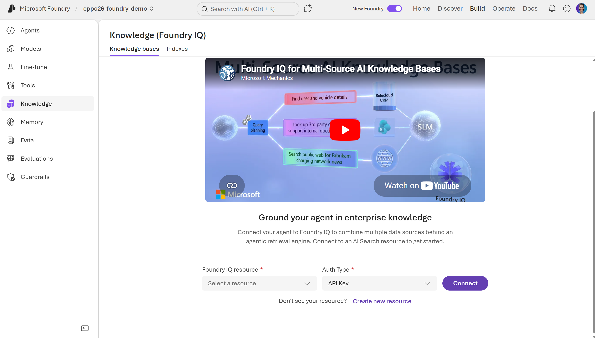
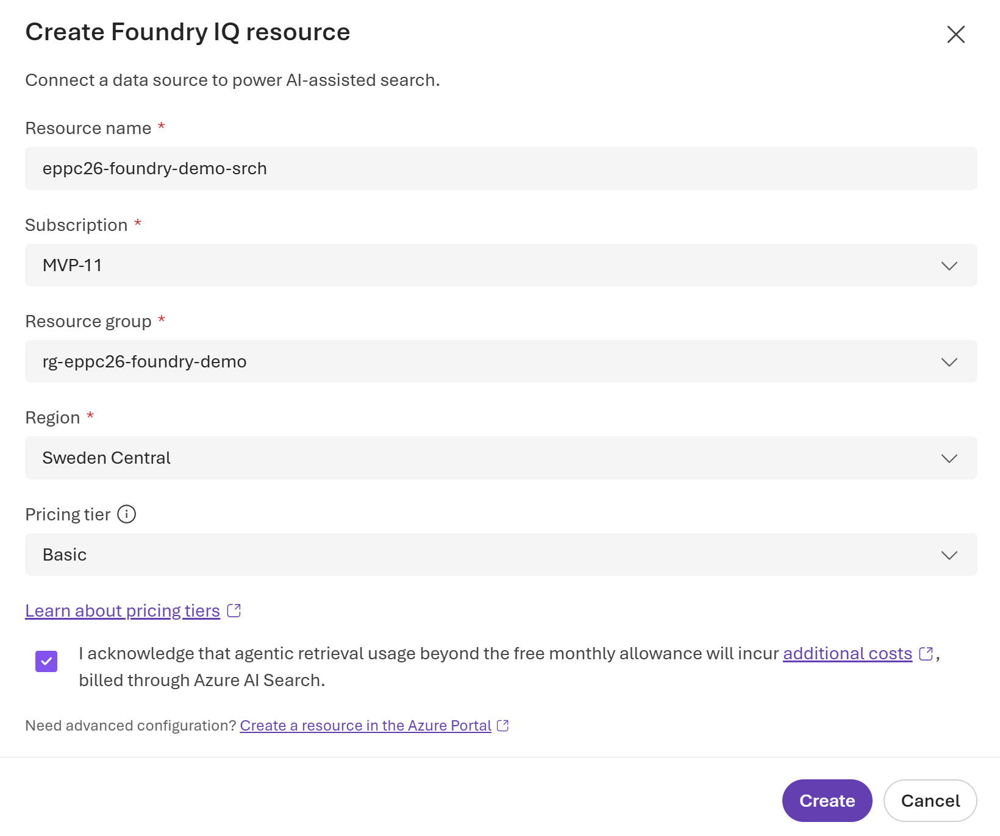
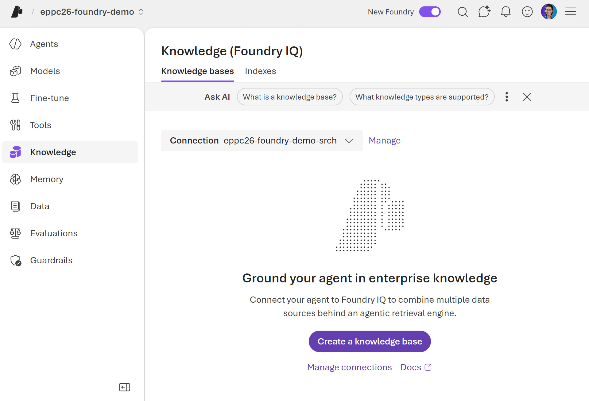
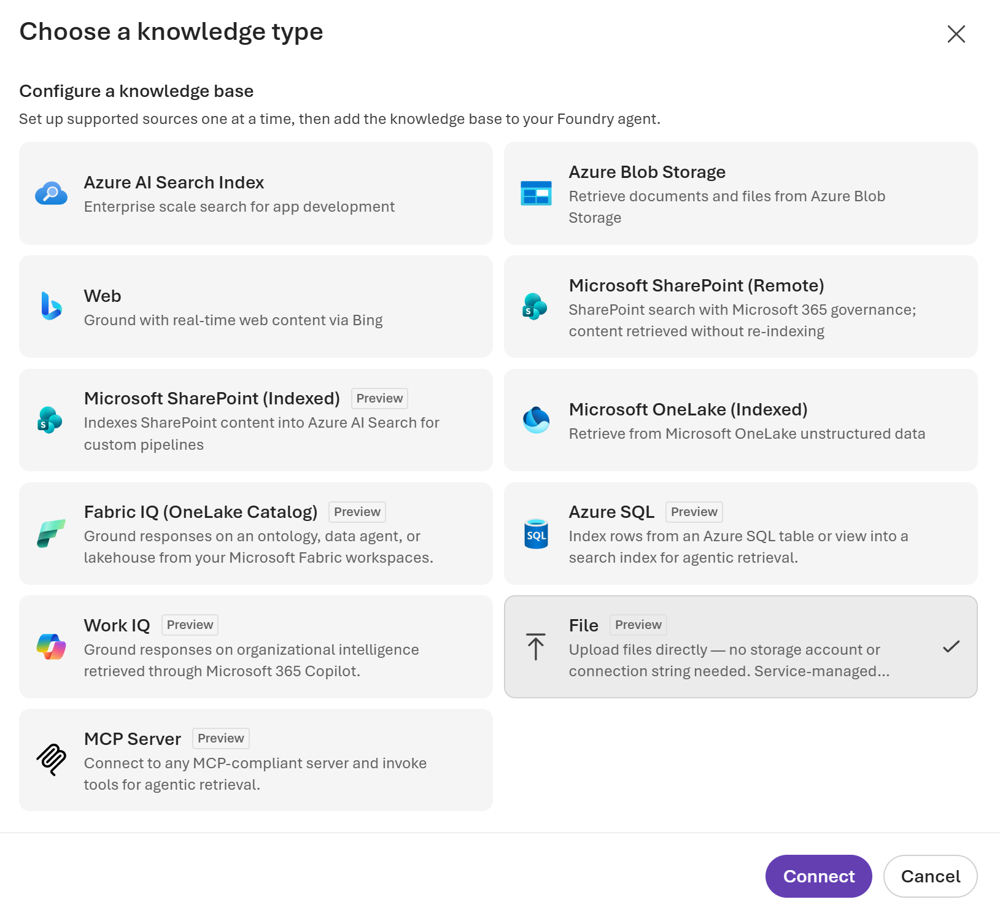
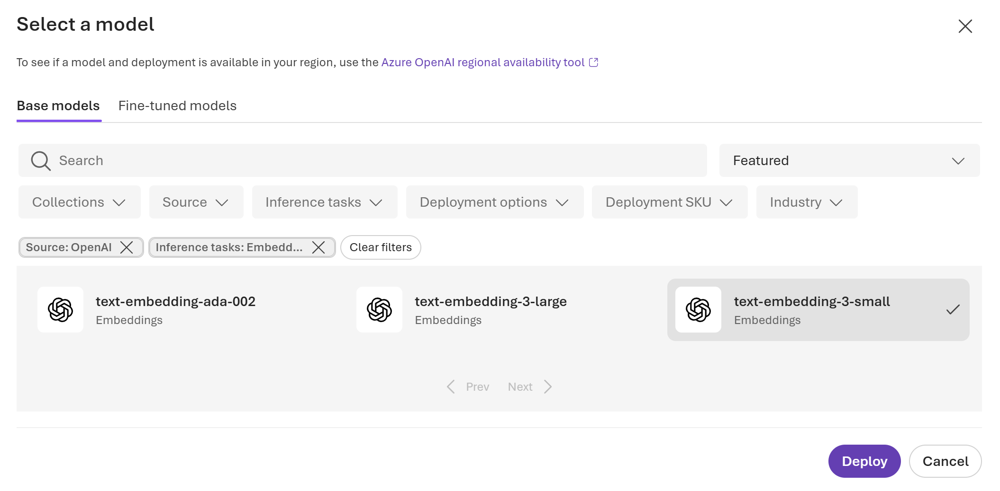
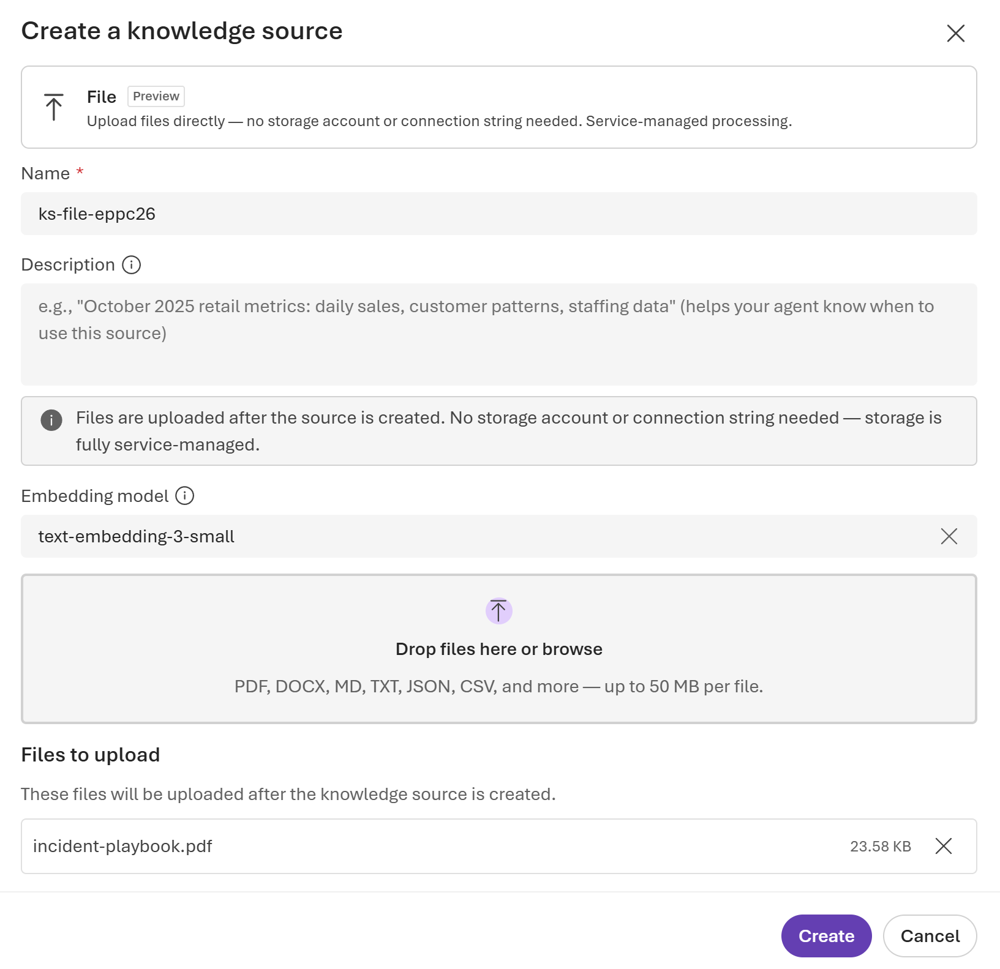
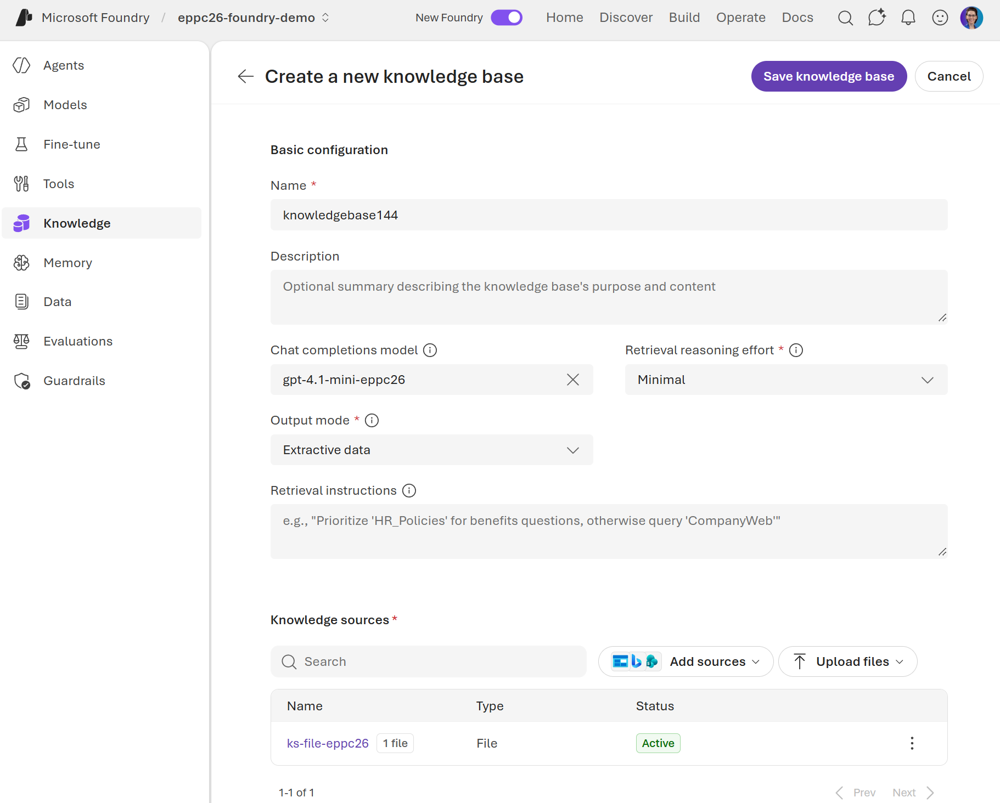
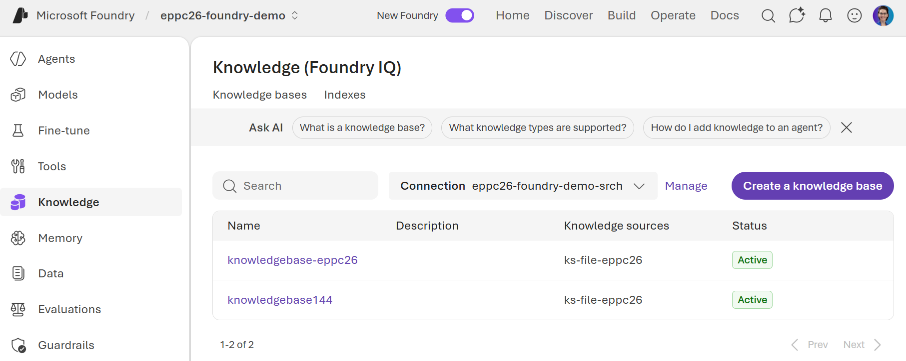

# Lab 2 — Build the Intelligence Layer in Microsoft Foundry

## Part 2 — Set up Foundry IQ knowledge base (15 min)

Foundry IQ is the enterprise knowledge layer for Foundry agents. It sits on top of Azure AI Search and provides agentic retrieval — meaning it automatically decomposes queries into subqueries, searches in parallel, and
applies semantic reranking before returning results to the agent.

This is the production-grade equivalent of what Copilot Studio does with its knowledge sources — but with visible retrieval, citation tracking, and reusable knowledge bases that any number of agents can share.

---

### Step 1 — Navigate to Foundry IQ

1. In the top menu bar, click **Build**.
2. In the left sidebar that appears, look for **Knowledge**.
3. Click **Knowledge**.

   > You see the Foundry IQ overview page. It currently shows no knowledge bases — you will create one now.

---

### Step 2 — Create a Foundry IQ resource (Free tier)

Foundry IQ requires an Azure AI Search resource as its underlying retrieval engine. You will create a Basic tier instance — sufficient for the lab (check all available tiers [here](https://azure.microsoft.com/en-us/pricing/details/search/)).

1. On the Foundry IQ page, click **Create new resource**.

2. A setup wizard opens. Fill in:

   **Resource name:** Type `eppc26-foundry-demo-srch`
   **Subscription:** Your Azure subscription  
   **Resource group:** Select `rg-eppc26-foundry-demo` (the one you created in Part 1)  
   **Region:** **Sweden Central** (must match your Foundry project region)
   **Pricing tier:** Select **Basic**

   

3. Click **Create**.

   > Provisioning takes 1–3 minutes. Once deployment is completed, the Foundry IQ resource will be connected to the Foundry project.

   

---

### Step 3 — Create the incident playbook knowledge base

1. On the Foundry IQ page, click **Create a knowledge base**.

2. Select **File** and click **Connect** (for the lab purpose we will upload files directly to the Foundry project, however for projects out of the workshop scope you can explore other available options).

3. Upload the **icident-playbook.pdf**.

4. in the **Embedding model** field click **Select model** and select **Browse more models**.

5. In the opened pop-up window select **text-embedding-3-small** and click **Deploy**.

6. Click **Create**.

7. Under **Chat completions model** select `gpt-4.1-mini-eppc26` model you built in Part 1. Under **Retrieval reasoning effort**, select **Minimal**.

   > **Retrieval reasoning effort** controls how aggressively Foundry IQ decomposes and iterates on queries:
   > - **Minimal** — single-pass retrieval, fastest, least thorough
   > - **Low** — recommended for most scenarios, good balance
   > - **Medium** — multi-pass iterative retrieval, most thorough, uses more tokens

   Click **Save knowledge base**.
   

   > Foundry IQ now automatically handles: chunking the PDF → creating embeddings → indexing into Azure AI Search → making it ready for  agentic retrieval. This takes 2–4 minutes.

8. You see knowledge bases on the **Knowledge** page with status **Active**.
    

---

### Step 4 — Test the knowledge base directly

The knowledge base chat interface is available in the Azure Portal - in the `Search service (Foundry IQ)` resource. This is where you can query the knowledge base directly, before connecting it to any agent.

Before you can query - assign yourself the required data plane role:

1. Open the Azure Portal in a new tab: https://portal.azure.com
2. Navigate to your `Search service (Foundry IQ)` resource:
   - Search for it by name (you gave in the previous step) in the top search bar, or
   - Go to Resource groups → your workshop resource group → click the resource (type: `Search service (Foundry IQ)`)

3. In the left menu of the Search service (Foundry IQ) resource, click Access control (IAM)
4. Click + Add → Add role assignment
5. On the Role tab, search for `Search Index Data Reader` → select it → click Next
6. On the Members tab, click + Select members → search for your account → select it → click Select
7. Click Review + assign

> Wait 5–10 minutes before proceeding. Role assignments in Azure AI Search do not take effect immediately. “An unexpected error occurred” on the knowledge base chat is almost always this. Do not skip the wait.

Now test the knowledge base:

8. Still in the Azure Portal, in the left menu of your Search service (Foundry IQ) resource, click Agentic retrival → Knowledge bases
9. Click on the knowledge base name you creater before
10. The knowledge base detail page opens. On the right side you see a chat interface with “How can I help you?”
Type this query and press Send:

    What is the escalation path for a Critical severity infrastructure incident?

The chat responds with retrieved content from the playbook.
Try a second query:

    How should I classify an incident where production data may have been exposed?

Observe: the knowledge base decomposes the query internally, retrieves relevant chunks from the Security section, and returns a grounded answer with source citations.

> This is the teaching moment: You are querying the retrieval layer directly, before the agent model ever sees the result. In Copilot Studio, you have no equivalent visibility — the knowledge lookup is black-box. Here you can confirm the playbook is indexed correctly and the right sections surface for the right questions, before you wire it to an agent.

> If the chat still errors after waiting 10 minutes: Also add the Search Service Contributor role using the same IAM steps above, wait another 5 minutes, and retry.
