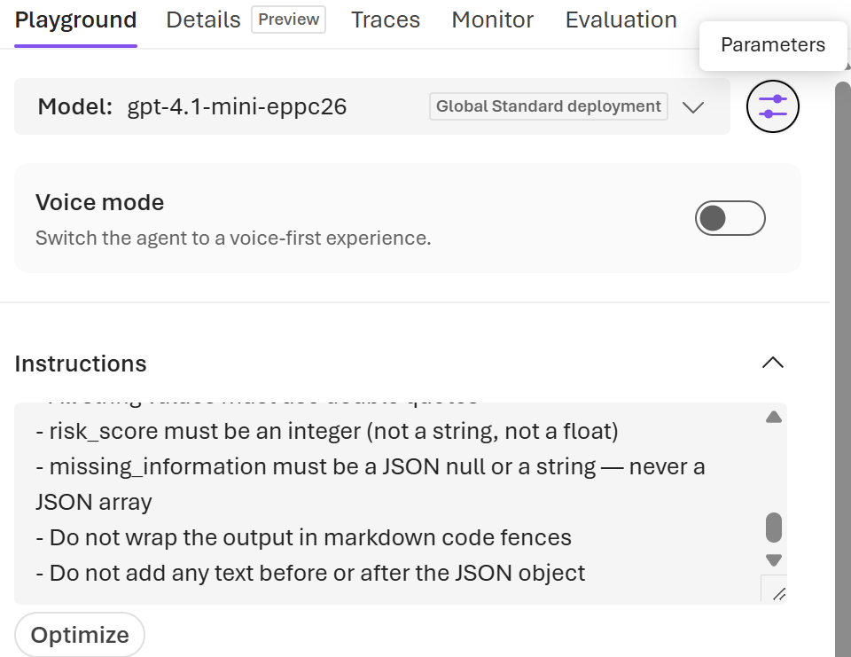
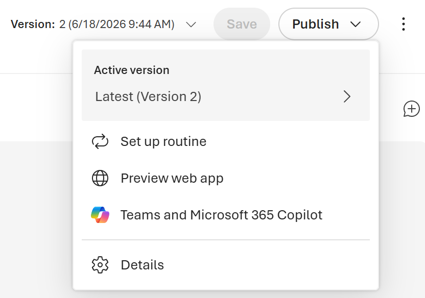
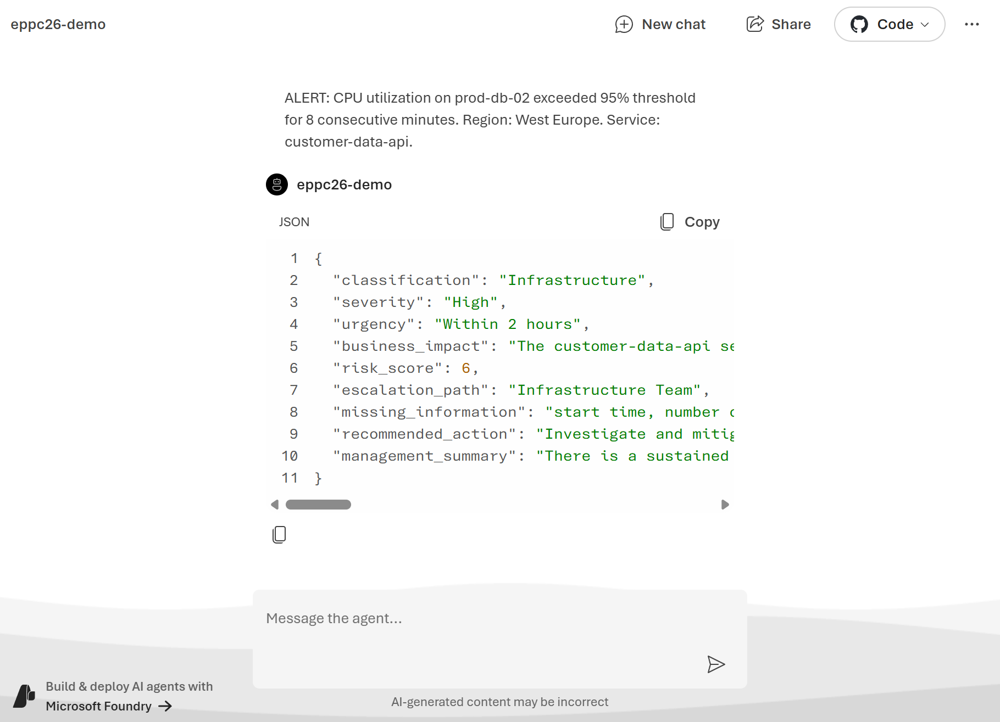
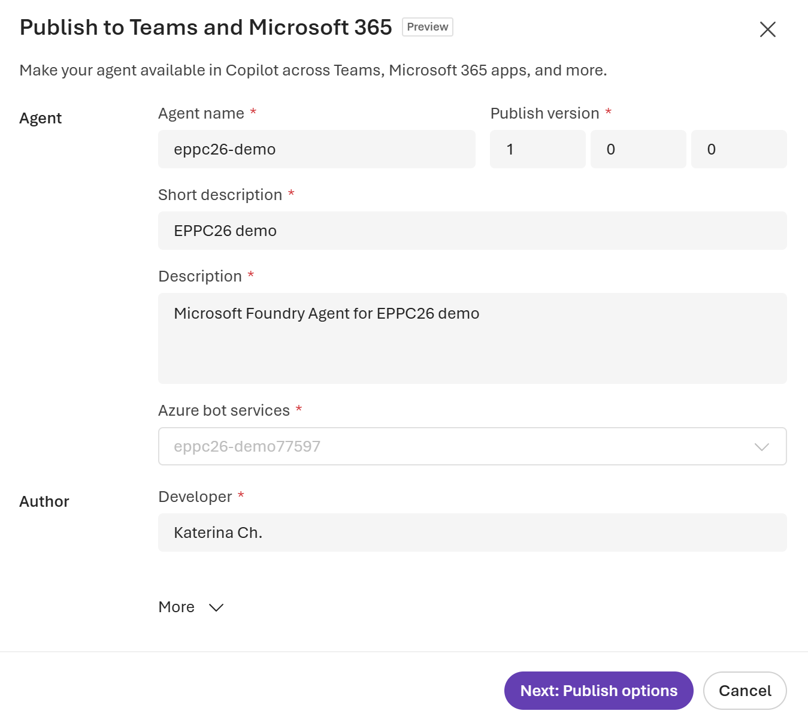
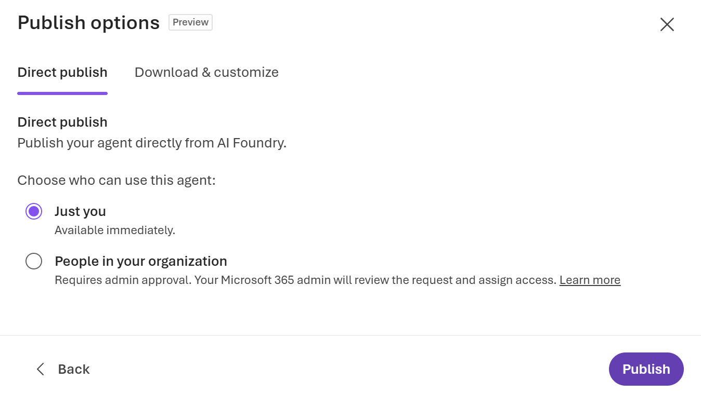
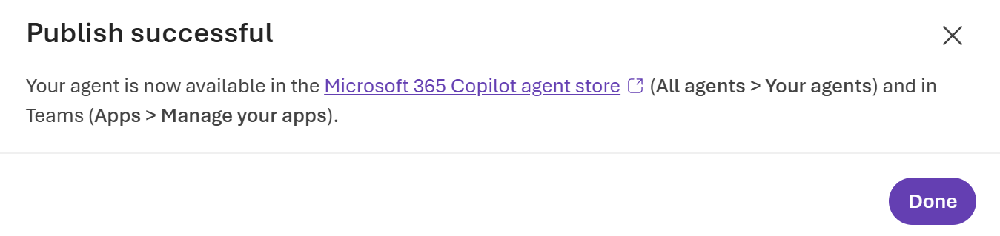
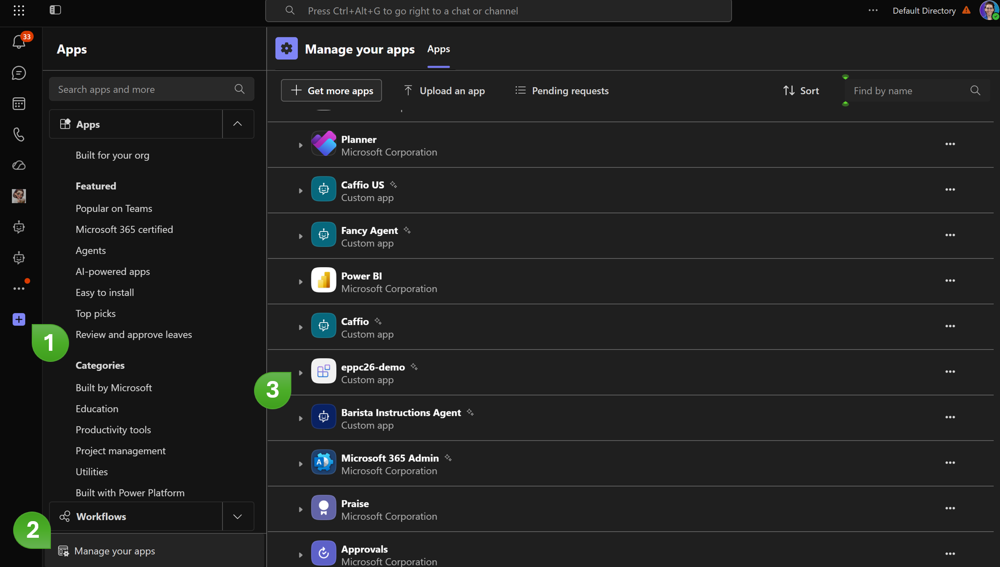

# Lab 2 — Build the Intelligence Layer in Microsoft Foundry

## Part 3 — Build the Prompt Agent (15 min)

### Step 1 — Create a new Prompt Agent

1. In the Foundry Project in the top menu bar, click **Build**.
2. In the left sidebar, click **Agents**.
3. Click **+ New agent** (select **Build an agent** in the drop-down list).
4. Fill in the agent name (e.g. `Incident Intelligence Agent`).

   > The agent is created and you are taken directly to its configuration page — the Agent Studio.

---

### Step 2 — Configure the Instructions

1. In the Agent Studio, you see a **Instructions** text area on the left side.
2. Clear any default text in the field.
3. Open [system-prompt-lab2.txt](./assets/system-prompt-lab2.txt) from the workshop repo and copy the full contents. Paste it into the System prompt field.
4. Hit **Save**.

---

### Step 3 — Set temperature and response format

This is where Foundry gives you control that Copilot Studio does not.

1. Look for the **Parameters** panel — it is in the right column of the Agent Studio.

2. Find the **Temperature** slider. Set it to `0`.

   > Temperature 0 makes the model deterministic — given the same input and the same retrieved context, it will always produce the same output. This is essential for a classification task where you need consistency.

3. Find the **Text format** setting. Click it and select
   **JSON Schema**.
4. A text field appears for the schema. Click inside it and paste the contents of [json-schema-incident.json](./assets/json-schema-incident.json). Click **Save**.

---

### Step 4 — Connect the Foundry IQ knowledge base as a tool

1. In the Agent Studio, look for the **Tools** section or a **+ Add tool**
   button (it may be in a sidebar or a tab at the bottom of the screen).
2. Click **Add** → **Brows all tools**.
3. In the tool picker panel, select **Azure AI Search** (or
   **Foundry IQ / Knowledge base**) and click **Add tool**.
4. Int he pop up window in the **Azure AI Search connection** select the resource you've created before, select index and click **Add**.

   > The knowledge base now appears as a tool connected to the agent. At inference time, the agent will automatically call this tool when it needs context from the playbook. It uses Model Context Protocol (MCP) under the hood — the same protocol that Work IQ uses in Studio.

5. **Do not add any other tools.** For this lab, the agent has only one
   tool: the Foundry IQ knowledge base. No code interpreter, no Bing
   Search, no function calls.

---

### Step 5 — Test in the Agent Playground

1. In the **Playground** in the chat interface submit **Incident #1** — the same one you used in Lab 1:

   ```
   Our payment service is throwing 503 errors intermittently since about 14:30. 
   Started after the deployment. Not sure if it's the new build or the infra. 
   Clients are complaining. Logs attached but I haven't had time to look at them.
   ```

2. Press **Enter**. The agent responds.

**What to check:**
- Is the response pure JSON with no surrounding text? (It should be.)
- Does every required field appear?
- Are enum values exactly as specified (e.g. `"High"` not `"high"` or
  `"HIGH"`)?
- Compare to your Lab 1 response — same incident, different output.
  Note any differences in classification, severity, or the management
  summary quality.

3. Now click **Traces** under the response.

   > A trace panel opens showing the full execution, including full response and evaluation metrics.

   This is the visibility that Lab 1 could not give you.

4. Submit **Incident #4** — the deceptively calm backup failure:

   ```
   Hi, I noticed the nightly backup job didn't complete last night. 
   Probably fine but thought I should mention it. 
   The job runs at 2am. Let me know if you need anything.
   ```

5. View the trace. Compare to Lab 1: did Studio catch the severity correctly? Does Foundry handle it differently, and can you now explain why?

6. Submit **Incident #3** — the automated monitoring alert:

   ```
   ALERT: CPU utilization on prod-db-02 exceeded 95% threshold for 8 consecutive minutes. Region: West Europe. Service: customer-data-api.
   ```

   Validate the agent's output.

---

### Step 6 — Publish agent

You can publish Microsoft Foundry agent to different channels. For this lab we will test the agent in Web.

1. In the Agent Playground click **Publish** on the right upper corner.

2. Select ** Preview web app**:


3. Test the agent by sending any of test phrases from the previous step.


4. Go back to the Agent Playground in Microsoft Foundry portal and publish to **Teams and Microsoft 365 Copilot**.

5. Fill in the form in the pop-up window and click **Next: Publish options**:


6. For the workshop select **Just you** option and click **Publish**: 


7. Once the publishing will be completed, you will see the following notification:


8. Click on the link in the notification. It will redirect you to the Microsoft 365 Copilot. Go to **More Agents** and select your agent.

> If you closed the notification window, then navigate to the [Teams](https://teams.cloud.microsoft/), login, and then:
>
> 1) Select **Apps**
> 2) Navigate to **Manage your apps**
> 3) Select your agent 
> 

9. Test the agent in Microsoft 365 Copilot and/or in Microsoft Teams.

> There might be **User Sign-in** appear. Click on **Open sighn-in link** to complete loggin process.