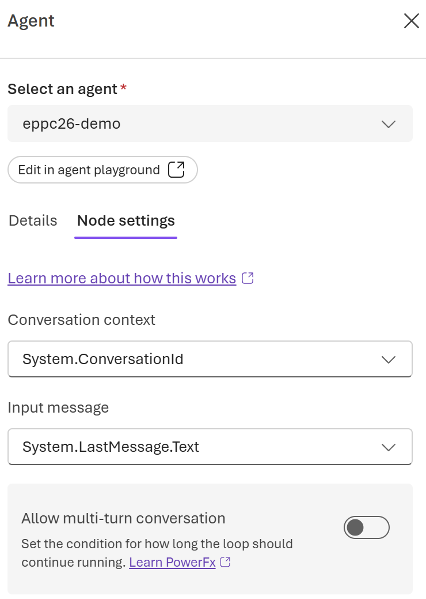
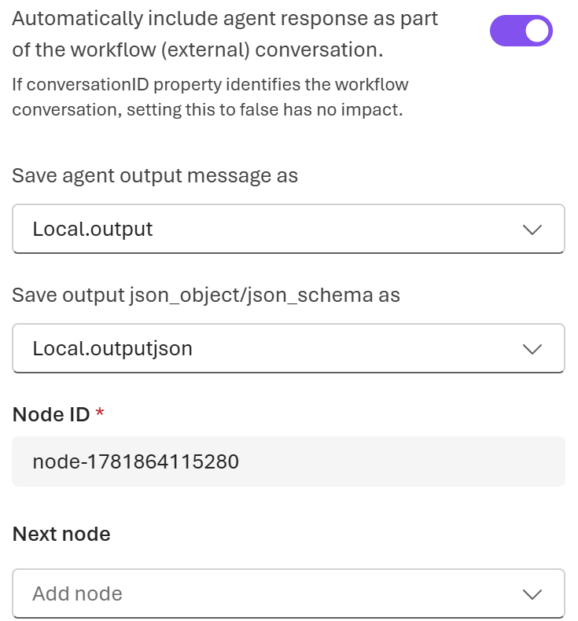
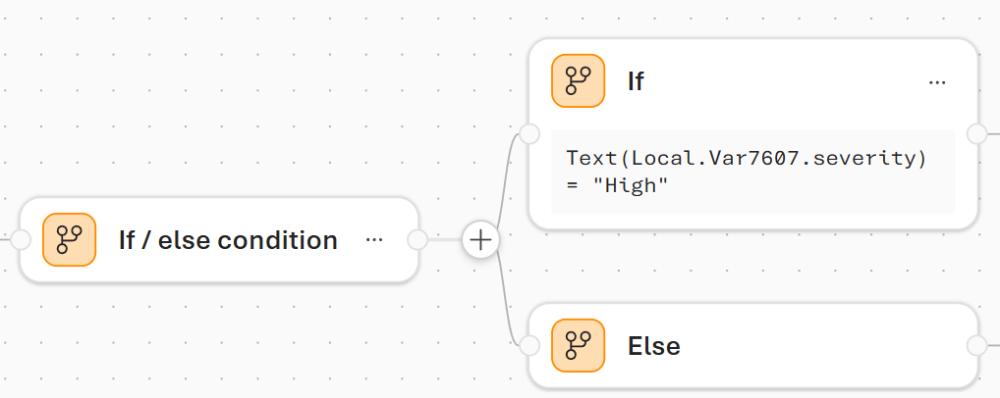
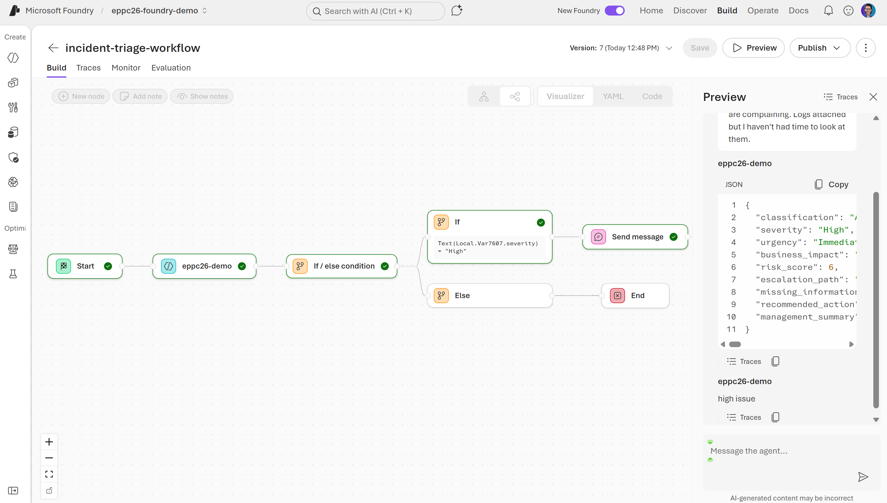
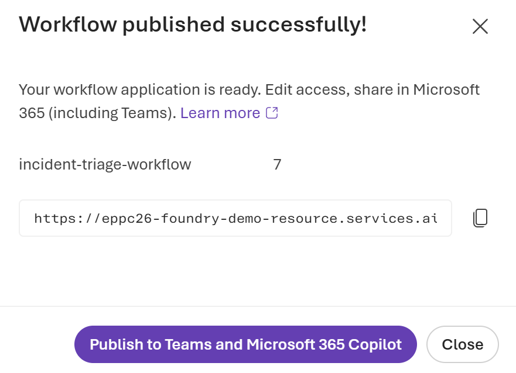
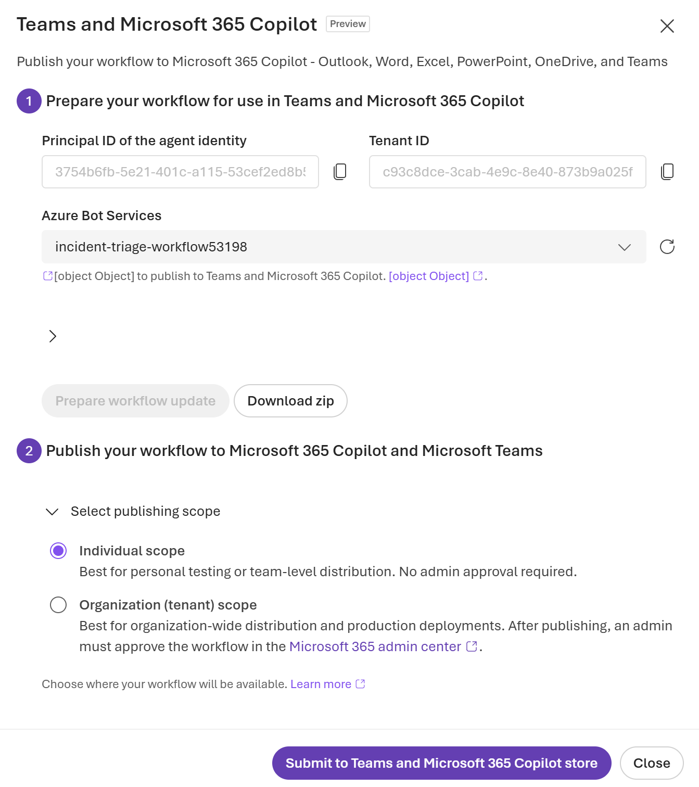

# Lab 2 — Build the Intelligence Layer in Microsoft Foundry

## Part 4 — Build the visual Workflow (10 min)

The Foundry Workflow is a visual, no-code orchestration builder. You define a sequence of nodes — each node is a step. The workflow can invoke agents, apply branching logic, and expose a REST endpoint. No YAML, no code.

This is the Foundry equivalent of the Agent Flow. Both are visual. Both allow branching. The key difference: the Foundry
Workflow is deterministic — every step, every branch, every execution is logged and inspectable. Compare this with Copilot Studio's generative orchestration, which decides at runtime what to do next.

---

### Step 1 — Create a blank Workflow

1. In the top menu bar, click **Build**.
2. In the left sidebar, click **Agents**.
3. At the top of the Agents page, click the **Workflows** tab.
4. Click **Create Workflow** → **Blank workflow**.

   > The visual workflow builder opens. You see a canvas with a Start node already placed. This node is a fixed anchor — leave it as-is.

5. Click **Save** and name the workflow in the pop-up window. Type: `incident-triage-workflow` and hit **Save**.

---

### Step 2 — Add the Start node

1. Click the + button next to the Start node on the canvas.
2. In the node picker that appears, select **Agent**.
3. In the **Agent window**, select your existing agent.
4. In the **Conversation context** section of the node, set the message field to the system variable that carries the user’s submitted text **Conversation context:** `System.ConversationId`, **Input message:** `System.LastMessage.Text`.


> System.LastMessage.Text is the built-in system variable that holds the last message received by the workflow — in our case, the incident report text. You do not create it; it is always available.

5. Configure agent output variables:


6. Click **Done** on the node, then click **Save** on the canvas toolbar.

---

### Step 3 — Add a Condition node

1. Click the **+** next the Agent node.
2. Select **If/else** from the node type list.
3. The condition configuration opens. Fill in the condition expression using Power Fx:

   Click in the condition field and type:
   ```
   Text(<YOUR_JSON_VARIABLE>.severity) = "High"
   ```

   > Power Fx is the same formula language used in Power Apps and Power Automate. You do not need to learn it — this single expression is all you need for the lab.

   

---

### Step 4 — Add End nodes to both branches

#### True branch (Hight):

1. Click the **+** on the **True** output of the Condition node.
2. Select **Send message**.
3. Add the text that should be sent: `Hight issue` and hit **Done** in the message node.
4. Click **Save**.

#### Else branch (Standard):

1. Click the **+** on the **Else** output of the Condition node.
2. Select **End**.
3. Click **Save**.

---

### Step 5 — Test the Workflow step by step

1. Click **Preview** in the top-right of the
   workflow builder.
2. A test panel opens on the right.
3. Paste and send **Incident #1**:

   ```
   Our payment service is throwing 503 errors intermittently since about 14:30. Started after the deployment. Not sure if it's the new build or the infra. Clients are complaining. Logs attached but I haven't had time to look at them.
   ```

4. Watch the canvas — nodes light up as they execute:
   - **Start** node → green (input received)
   - **Agent** node → spinning (calling the Incident Intelligence Agent)
   - **Condition** node → evaluates severity
   - The appropriate **True** node → lights up with the output

   

---

### Step 6 — Publish the Workflow

1. After testing, click **Publish** and select **Publish as Workflow app**.
2. In the pop-up windows select **Publish to Teams and Microsoft 365 Copilot**:
 

3. In the new window fill in all fields. In the **Azere Bot Services** select `Create Bot Service`.

4. Click **Prepare workflow**.

5. Once everything has been configured, hit **Submit to Teams and Microsoft 365 Copilot store**:


6. Test the workflow in Microsoft Teams and Microsoft 365 Copilot the same way as you tested your Foundry agent.