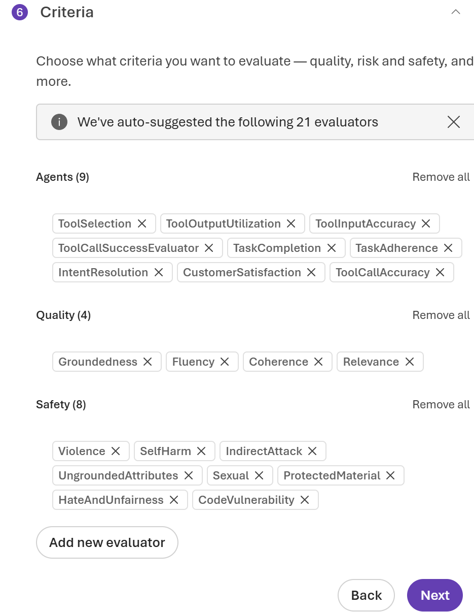

# Lab 2 — Build the Intelligence Layer in Microsoft Foundry

## Part 5 — Run Evaluation (15 min)

The Foundry evaluation wizard runs your agent against a dataset and scores it on multiple quality dimensions. Crucially, every failing result links directly to the execution trace — so you can see not just *that* it failed but *why* it failed and *where* in the execution the failure occurred.

---

### Step 1 — Open the Evaluation section

1. In the top menu bar of your project, click **Build** and navigate to **Evaluations** on the left pane.
2. The Evaluation page opens. Click **Create**.
3. A wizard starts. On the first screen, select:

   **What are you evaluating?** → **Agent**  
   **Select agent:** → select your Foundry agent

4. Click **Next**.
5. On the **Scope** screen select **Individual turns** and click **Next**.

---

### Step 2 — Upload the evaluation dataset

1. On the dataset screen, select either **Generate** (this option will generate synthetic dataset for the evaluation) or **Existing dataset** (this option will required to upload your dataset). We will proceed with the **Existing dataset** option.
2. Click **Upload new dataset** and select [evaluation-set-10](./assets/evaluation-set-10.jsonl) from the workshop repo.

   > The file is JSONL format (JSON Lines — one JSON object per line). Each record contains four fields:
   > - query — the incident report text (what the agent receives)
   > - ground_truth — the reference answer (what a correct response should convey)
   > - response — a pre-generated ideal agent response (used by evaluators for comparison)
   > - context — the relevant playbook excerpts that should ground the response (used for groundedness scoring)
   >
   > The workshop CSV has all columns for all 10 incidents.

3. The file uploads and Foundry shows a preview of the first few rows.
   Confirm the column mappings look correct.
4. Click **Next**.
5. Confirm the preselected model and verify the data mapping. Click **Next**.
6. Keep the next section as is (**Configure agents**) and click **Next**.

---

### Step 3 — Select evaluators

1. On the **Criteria** screen, you see a list of preselected quality metrics. You can keep them all or decrease the number of metrics.

   We suggest to keep enabled **three** evaluators by checking their boxes:

   ✅ **Groundedness** — Is the response supported by the retrieved context
   (the playbook)? Catches hallucination — when the agent makes up facts
   not in the document.

   ✅ **Relevance** — Does the response actually address what was asked?
   Catches when the agent produces a correct-looking response that misses
   the actual question.

   ✅ **Task adherence** — Did the agent follow its instructions? Checks
   whether the output format, field completeness, and behavioural rules
   from the system prompt were followed.

2. Click **Next**.

---

### Step 4 — Configure and run

1. Give the evaluation a name: `Incident Dataset v1 — Lab 2`
2. Review the summary.
3. Click **Submit**.

   > The evaluation runs in the background. With 10 test cases and 3
   > evaluators, it typically takes 3–5 minutes. A progress bar shows
   > overall completion.

   While the evaluation runs, continue to Step 6.

---

### Step 5 — Review evaluation results

1. Open the **Evaluations** page.
2. Your evaluation run should now be complete (if not, wait until it is).
3. Click on the evaluation you run to open the results.
4. The results table shows:
   - Each row = one test case (one incident report)
   - Each column = one evaluator score (Groundedness / Relevance / Task adherence)
   - Each cell shows a score (typically 1–5) and a Pass/Fail indicator
5. Look at the **summary panel** — it shows aggregate scores across all 10 test cases for each evaluator.
6. Find a **failing row** (a test case with a low score on any evaluator) and explore it.

---

### Step 6 — Connect Application Insights for full trace visibility

Without this step the Traces tab in the Agent Playground shows only basic responses — no tool calls, no retrieved chunks, no per-step latency. This one-time setup unlocks full execution traces.

1. In the Agent Playground click **Traces**.
2. If no Application Insights resource is connected, you will see a prompt to connect one.
3. Click **Connect**. 
4. In the opened window select **Create new resource** to create a new Application Insights resource.
5. Accept the defaults (name and resource group are pre-filled). Click **Create**.

> Application Insights is NOT created automatically with the new Foundry project. You must connect it here. It becomes the new resource in your resource group.

After this setup, every Agent run (e.g. in Web) will generate a full trace.

While the evaluation runs, look at one trace in detail from the manual tests you ran earlier.

1. Click **Build** in the top menu bar → **Agents** → click on your agent.
2. In the Agent Studio, click the **Traces** tab and select **Responses**.
3. You see a list of recent inference calls from the Playground tests.
4. Click on the trace for **Incident #4** (the backup failure).
5. The trace detail view opens. Explore the three sections:

   **Section A — Input**
   - The full system prompt sent to the model (every token)
   - The user message (the incident text)
   - The knowledge base tool call request (the query sent to Foundry IQ)

   **Section B — Tool execution**
   - The query Foundry IQ received: note how it may be different from
     the raw incident text — the agentic retrieval engine decomposed it
   - The document chunks returned: you can read the actual text of each
     chunk and its relevance score
   - The order in which chunks were returned

   **Section C — Output**
   - The raw JSON response from the model
   - Token count: input tokens + output tokens
   - Latency: total ms, breakdown by step

> **This is the root cause capability:** If an evaluation result fails,
> you can link directly from the failing score to this trace and see
> whether the failure was:
> - The retrieval step (wrong chunks returned — Foundry IQ issue)
> - The model step (right chunks returned but model ignored them — prompt issue)
> - The format step (model returned correct content but wrong structure — schema issue)
>
> In Lab 1, none of this was visible. You knew the agent failed. You did
> not know why.

